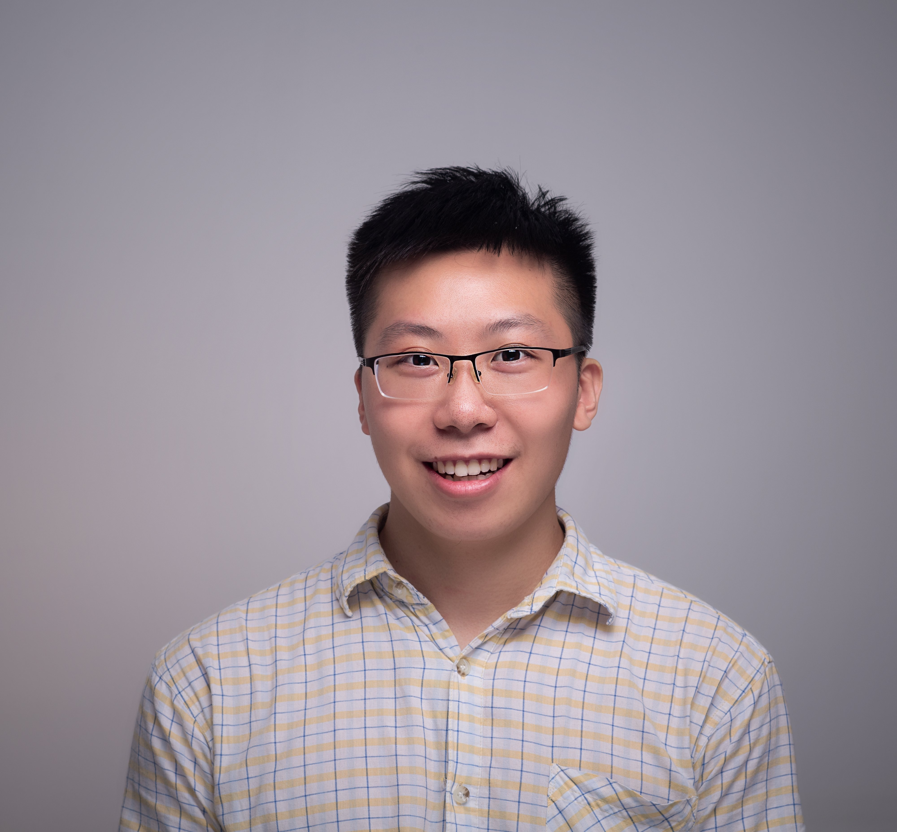

# Guanbin Chen

## Personal Information

<table>
  <tr>
    <td width="40%">Sex</td><td width="40%">Male</td>
    <td rowspan="4"></td>
  </tr>
  <tr><td>Nationality</td><td>Chinese</td></tr>
  <tr><td>Date of Birth</td><td>1997.04</td></tr>
</table>

## Personal Introduction

Guanbin Chen currently studies at the MOST(Micro-Optical Sectioning Tomography)laboritory, Britton Chance Research Center for Biomedical Photonics, Wuhan National Laboratory for Optoelectronics, Huazhong University of Science and Technology.

He does research in image processing and analyzing about neuroscience image of mesoscopic level, e.g. mouse brain neuron and vessel. In addition, He also does research in algorithms, incluing theory and application.

He is interested in and quite good at algorithms, and has gained awards in programming and mathematical modeling which are shown below.

He is glad to communicate with researchers. If you have any advice and questions, please email with me(1249591860@qq.com , chenguanbin1997@outlook.com).

He enjoys comics and literature, and willing to try anything. 

## Personal Presentation

- Personal Page：[https://congmingyige.github.io](https://congmingyige.github.io)
- Blog：[http://www.cnblogs.com/cmyg](http://www.cnblogs.com/cmyg)
- GitHub：[https://github.com/congmingyige](https://github.com/congmingyige)
- Download Profile：[GuanbinChen_Profile](/个人简历.doc)

## Honor

- The ACM ICPC Asia Regional Contest Jiaozuo Site 2018, Qingdao Site 2018, China Invitational Nanchang 2019 Silver Medal(group of three, three times)
- 2017 High Education Club Cup National Undergraduate Mathematical Modeling Contest Undergraduate Group National Second Prize
- during undergraduate period, Chinese National Scholarship once, Lanzhou Univerisity Scholarship three times
- in Programming Competition of Lanzhou University, one of initiator , one of the examinee for the first, second and third competition
- 2013,2014 National Olympiad in Informatics in Provinces(NOIP) Senior Group National(Guangdong Site) Second Prize(reach the minimum first prize score in most of the province)
- 2011 National Olympiad in Informatics in Provinces(NOIP) Senior Group National(Guangdong Site) First Prize(Guangzhou 7th)
- 2011,2012 National Junior School Maths Competion First Prize(when in junior two, compete with junior three)
- "Cup of Hope" National Mathematics Invitational Tournament/Contest/Competition Primary Group First Prize

## Scientific Thought

### Spirit
- efficient study(correct time and method)
- correct task planning(things, order)
- balance work with rest
- Persevere

## Educational Background
<table width="100%" border="1">
  <tr><th>Time</th><th>School(Degree)</th><th>Major</th></tr>
  <tr><td>2019.09-2025.06</td><td>Huazhong University of Science & Technology(master, recommended)</td><td>Computer Science and Technology(Biomedical Engineering)</td></tr>
  <tr><td>2015.09-2019.06</td><td>Lanzhou University(undergraduate)</td><td>Computer Science and Technology</td></tr>
</table>
