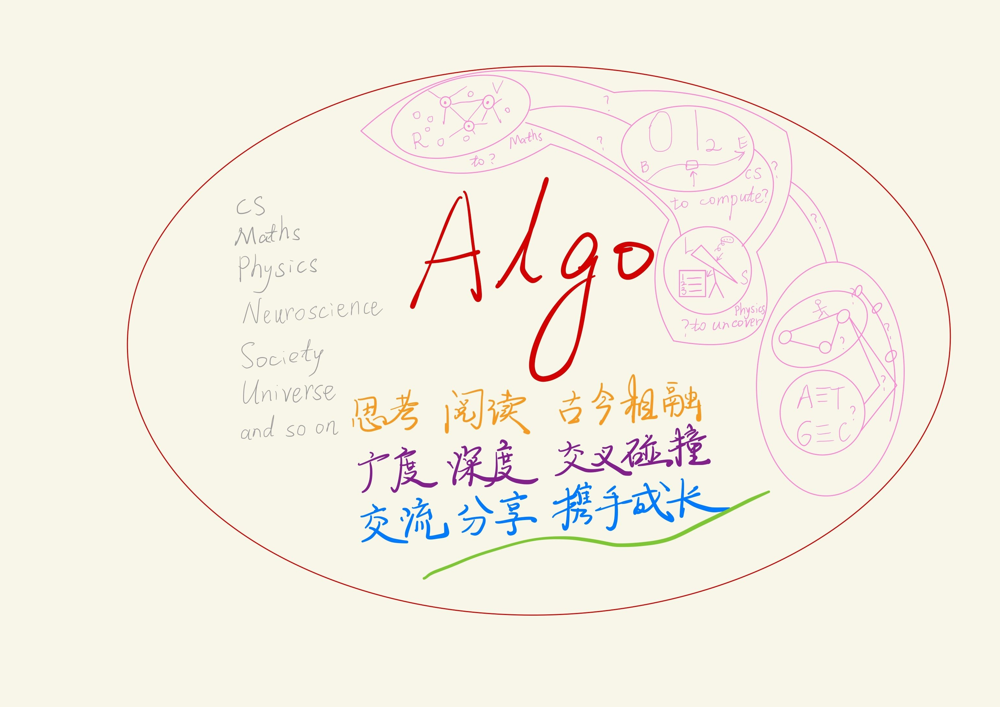
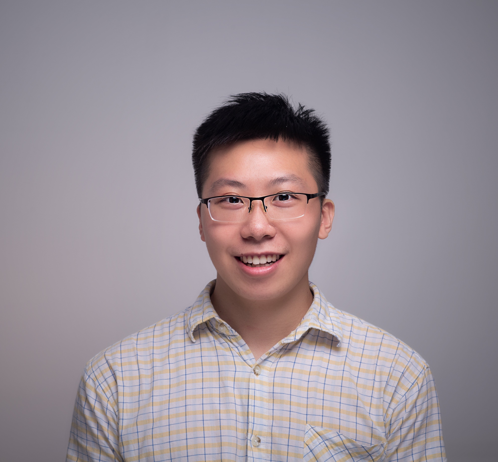

关注脑科学&神经科学（图像处理、分析）、计算机（算法等）、数学（组合数学等）、物理（量子、天文，只是兴趣）的动态，有兴趣可联系我

Focus on brain science&neuroscience(image processing and analysis)、computer science(algorithm and so on)、maths(combinatorics and so on)、physics(quantum、astronomy, just interest). Welcome to contact with me.

[English Version(Click Here)](#jump)

# 陈冠斌的个人主页

## 个人信息

<table>
  <tr>
    <td width="40%">性别</td><td width="40%">男</td>
    <td rowspan="4"></td>
  </tr>
  <tr><td>国籍</td><td>中国</td></tr>
  <tr><td>民族</td><td>汉族</td></tr>
  <tr><td>出生年月</td><td>1997.04</td></tr>
</table> 

## 个人简介
陈冠斌目前就读于MOST(Micro-Optical Sectioning Tomography)实验室，Britton Chance Research Center for Biomedical Photonics研究中心，武汉光电国家研究中心，华中科技大学。

他目前研究图像处理与分析，对象是介观层次的神经科学图像，如鼠脑神经元血管等。此外，他还研究算法，包括算法的理论研究与应用。

他喜欢和擅长算法，曾获程序设计和数学建模的奖项（见下文）。

他乐意与大家进行学术上的交流，如果有任意建议或问题，请邮箱联系(1249591860@qq.com , chenguanbin1997@outlook.com)。

他是一个喜欢动漫，文学的人，任意事情都喜欢尝试。他希望能从动漫中找到童真和创造力，保持活力，对生活和事情抱有热情。他希望能从书籍的海洋中获得知识、力量和阅历，成为一个更好的自己。

## 个人展示
- 个人主页: [https://congmingyige.github.io](https://congmingyige.github.io)  
- Blog(Thinking and Coding): [http://www.cnblogs.com/cmyg](http://www.cnblogs.com/cmyg)  
- BiliBili(Video about algorithms and so on made by myself): [https://space.bilibili.com/20296586/video](https://space.bilibili.com/20296586/video)
- GitHub(Project): [https://github.com/congmingyige](https://github.com/congmingyige)  
- 个人简介下载: [陈冠斌个人简介](/陈冠斌_中文.pdf)

## 研究方向

### 研究方向1

#### 方向
图像处理与分析，对象是介观层次的神经科学图像，如鼠脑神经元血管等

#### 内容
交叉学科：计算机（算法，大数据，可视化）、神经科学、数学、物理、医学

#### 个人研究成果
to be added

#### 实验室研究成果
- 骆清铭. (2017). 脑空间信息学——连接脑科学与类脑人工智能的桥梁. 中国科学:生命科学, 10 vo 47, 1015–1024.
- Li, A., Gong, H., Zhang, B., Wang, Q., Yan, C., Wu, J., Liu, Q., Zeng, S., & Luo, Q. (2010). Micro-Optical Sectioning Tomography to Obtain a High-Resolution Atlas of the Mouse Brain. Science, 330(6009), p.1404-1408.
- Li, A., Guan, Y., Gong, H., & Luo, Q. (2019). Challenges of Processing and Analyzing Big Data in Mesoscopic Whole-brain Imaging. Genomics, Proteomics & Bioinformatics, 17(4), 337–343.

### 研究方向2
#### 方向
算法，包括算法的理论研究与应用

#### 个人研究成果
to be added

## 荣誉
- 2018 ACM-ICPC International Collegiate Programming Contest 亚洲区域赛焦作、亚洲区域赛青岛、全国邀请赛南昌银奖（团体，三人），我校第一个铜/银奖，感谢队友、同学和教练~ 让我有机会重新拾起算法
- 2017 高教社杯全国大学生数学建模竞赛本科组全国二等奖（团体，三人）
- 本科期间共获国家奖学金一次，剩余均获校一等奖学金
- 兰州大学程序设计竞赛的提出者之一，第一、二、三次竞赛的出题人、验题人、组织者之一
- 2013,2014 高中信息学竞赛（NOIP）全国二等奖（广东；到达绝大部分省份一等奖分数线）
- 2011 初中信息学竞赛（NOIP）全国一等奖（广东；排名广州第7）
- 2011,2012 初中数学竞赛全国一等奖（初二的时候与初三同台竞争）
- 小学数学希望杯全国一等奖
- 天文（高中某个省赛初赛一等奖）
- 机器人（高中某个比赛三等奖；软硬件）

## 科研想法
### 品质
- 高效学习（正确时间和方式）
- 正确计划规划（内容，顺序）
- 劳逸结合
- 坚持

## 教育背景

<table>
  <tr><th>时间</th><th>学校（学位）</th><th>专业</th></tr>
  <tr><td>2019.09-至今</td><td>华中科技大学（直博）</td><td>计算机科学与技术（转；本身生物医学工程）；会关注CS（算法）、神经科学、Maths（组合数学）、Physics（量子、天文）的动态，有兴趣可联系我</td></tr>
  <tr><td>2015.09-2019.06</td><td>兰州大学（本科）</td><td>计算机科学与技术</td></tr>
  <tr><td>2012.09-2015.06</td><td>广东实验中学</td><td>关注计算机（数学已太渣……）</td></tr>
  <tr><td>2009.09-2012.06</td><td>广州市六中珠江中学</td><td>关注数学、计算机</td></tr>
  <tr><td>2003.09-2019.06</td><td>广州市同福中路第一小学</td><td>关注数学</td></tr>
</table>

   

# Homepage of Guanbin Chen

## Personal Information

<table>
  <tr>
    <td width="40%">Sex</td><td width="40%">Male</td>
    <td rowspan="4"></td>
  </tr>
  <tr><td>Nationality</td><td>Chinese</td></tr>
  <tr><td>Ethn</td><td>Han</td></tr>
  <tr><td>Date of Birth</td><td>1997.04</td></tr>
</table>

## Personal Introduction
Guanbin Chen currently studies at the MOST(Micro-Optical Sectioning Tomography)laboritory, Britton Chance Research Center for Biomedical Photonics, Wuhan National Laboratory for Optoelectronics, Huazhong University of Science and Technology.

He does research in image processing and analyzing about neuroscience image of mesoscopic level, e.g. mouse brain neuron and vessel. In addition, He also does research in algorithms, incluing theory and application.

He is interested in and quite good at algorithms, and has gained awards in programming and mathematical modeling which are shown below.

He is glad to communicate with researchers. If you have any advice and questions, please email with me(1249591860@qq.com , chenguanbin1997@outlook.com).

He enjoys comics and literature, and willing to try anything.

## Personal Presentation
- Personal Page: [https://congmingyige.github.io](https://congmingyige.github.io)
- Blog(Thinking and Coding): [http://www.cnblogs.com/cmyg](http://www.cnblogs.com/cmyg)  
- BiliBili(Video about algorithms and so on made by myself): [https://space.bilibili.com/20296586/video](https://space.bilibili.com/20296586/video)
- GitHub(Project): [https://github.com/congmingyige](https://github.com/congmingyige)  
- Download Profile: [GuanbinChen_Profile](/GuanbinChen_english.pdf)

## Research Direction

### Research Direction 1

#### Direction
image processing and analyzing about neuroscience image of mesoscopic level, e.g. mouse brain neuron and vessel

#### Content
interdiscipline：CS(algorithms，big data，visualation)、neuorscience、maths、physics、medical

#### Personaly Research Results
to be added

#### Laboritory Research Results
- Luo, Q. (2017). Brainsmatics—bridging the brain science and brain-inspired artificial intelligence. SCIENTIA SINICA Vitae, 10 vo 47, 1015–1024.
- Li, A., Gong, H., Zhang, B., Wang, Q., Yan, C., Wu, J., Liu, Q., Zeng, S., & Luo, Q. (2010). Micro-Optical Sectioning Tomography to Obtain a High-Resolution Atlas of the Mouse Brain. Science, 330(6009), p.1404-1408.
- Li, A., Guan, Y., Gong, H., & Luo, Q. (2019). Challenges of Processing and Analyzing Big Data in Mesoscopic Whole-brain Imaging. Genomics, Proteomics & Bioinformatics, 17(4), 337–343.

### Research Direction 2
#### Direction
algorithms, incluing theory and application

#### Personaly Research Results
to be added

## Honor
- The ACM ICPC Asia Regional Contest Jiaozuo Site 2018, Qingdao Site 2018, China Invitational Nanchang 2019 Silver Medal(group of three, three times)
- 2017 High Education Club Cup National Undergraduate Mathematical Modeling Contest Undergraduate Group National Second Prize
- during undergraduate period, Chinese National Scholarship once, Lanzhou Univerisity Scholarship three times
- in Programming Competition of Lanzhou University, one of initiator , one of the examinee for the first, second and third competition
- 2013,2014 National Olympiad in Informatics in Provinces(NOIP) Senior Group National(Guangdong Site) Second Prize(reach the minimum first prize score in most of the province)
- 2011 National Olympiad in Informatics in Provinces(NOIP) Senior Group National(Guangdong Site) First Prize(Guangzhou 7th)
- 2011,2012 National Junior School Maths Competion First Prize(when in junior two, compete with junior three)
- "Cup of Hope" National Mathematics Invitational Tournament/Contest/Competition Primary Group First Prize

## Scientific Thought
### Spirit
- efficient study(correct time and method)
- correct task planning(things, order)
- balance work with rest
- Persevere

## Educational Background

<table border="1">
  <tr><th>Time</th><th>School(Degree)</th><th>Major</th></tr>
  <tr><td>2019.09-Now</td><td>Huazhong University of Science & Technology(under postgraduate)</td><td>Computer Science and Technology(Biomedical Engineering)</td></tr>
  <tr><td>2015.09-2019.06</td><td>Lanzhou University(undergraduate)</td><td>Computer Science and Technology</td></tr>
</table>

